# System Architecture Diagrams
## Volunteer Comments Analysis System

---

## 1. High-Level System Architecture

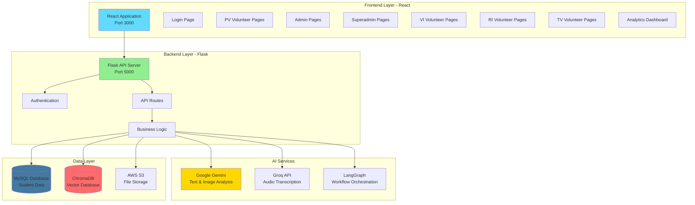

---

## 2. User Role Hierarchy & Access Flow

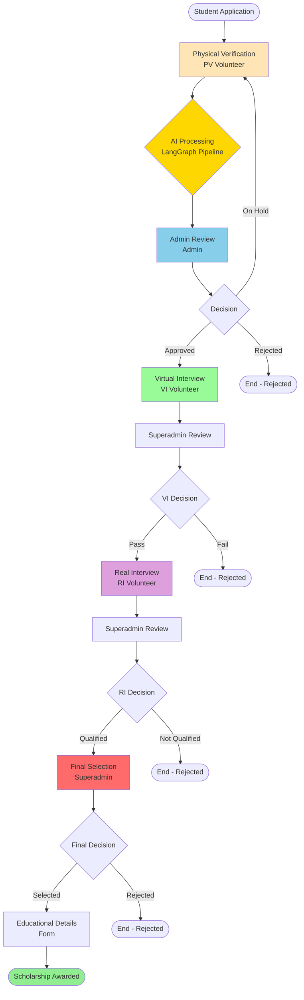

---

## 3. AI-Powered Workflow (LangGraph Pipeline)

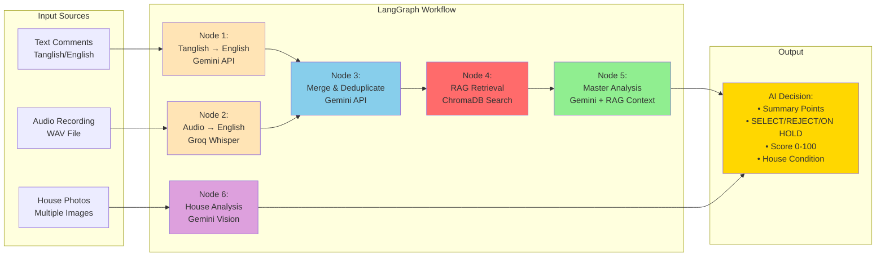

---

## 4. RAG (Retrieval-Augmented Generation) Architecture

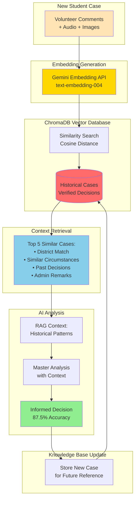

---

## 5. Complete Data Flow Diagram

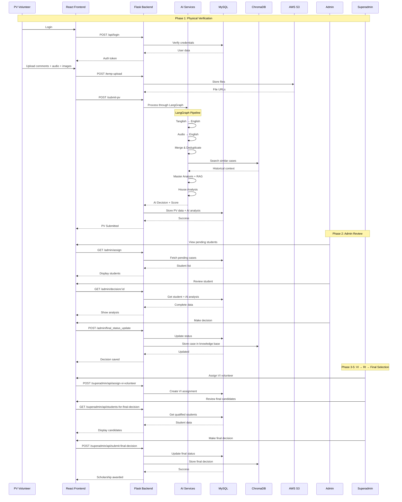

---

## 6. Database Schema Overview

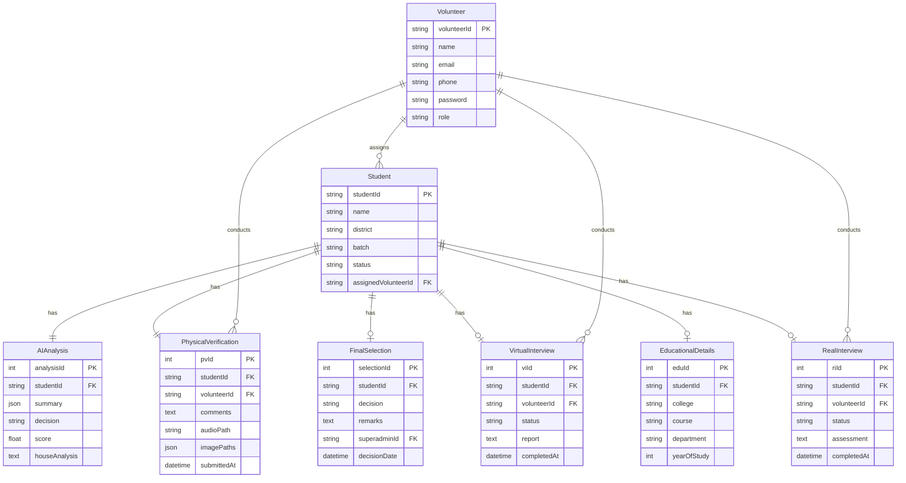

---

## 7. API Architecture & Endpoints

```mermaid
graph TB
    subgraph "Client Applications"
        Web[React Web App<br/>Port 3000]
    end
    
    subgraph "API Gateway - Flask"
        Gateway[Flask Server<br/>Port 5000<br/>CORS Enabled]
    end
    
    subgraph "Authentication Routes"
        Auth1[POST /api/login]
        Auth2[GET /logout]
    end
    
    subgraph "PV Volunteer Routes"
        PV1[GET /api/assigned-students]
        PV2[POST /temp-upload]
        PV3[POST /submit-pv]
        PV4[GET /api/pv-status/:id]
    end
    
    subgraph "Admin Routes"
        Admin1[GET /admin/assign]
        Admin2[GET /admin/decision/:id]
        Admin3[POST /admin/final_status_update/:id]
        Admin4[GET /api/analytics/*]
    end
    
    subgraph "Superadmin Routes"
        Super1[GET /superadmin/api/approved-students]
        Super2[POST /superadmin/api/assign-vi-volunteer]
        Super3[GET /superadmin/api/completed-vi]
        Super4[POST /superadmin/api/submit-final-decision]
        Super5[GET /superadmin/api/final-decisions]
    end
    
    subgraph "VI/RI Volunteer Routes"
        VI1[GET /vi/api/assigned-interviews]
        VI2[POST /vi/api/submit-interview]
        RI1[GET /ri/api/assigned-interviews]
        RI2[POST /ri/api/submit-assessment]
    end
    
    Web --> Gateway
    Gateway --> Auth1
    Gateway --> Auth2
    Gateway --> PV1
    Gateway --> PV2
    Gateway --> PV3
    Gateway --> Admin1
    Gateway --> Admin2
    Gateway --> Admin3
    Gateway --> Super1
    Gateway --> Super2
    Gateway --> Super3
    Gateway --> VI1
    Gateway --> RI1
    
    style Gateway fill:#90EE90
    style Auth1 fill:#FFE4B5
    style PV1 fill:#87CEEB
    style Admin1 fill:#DDA0DD
    style Super1 fill:#FF6B6B
    style VI1 fill:#98FB98
```

---

## 8. Deployment Architecture

### Development Environment
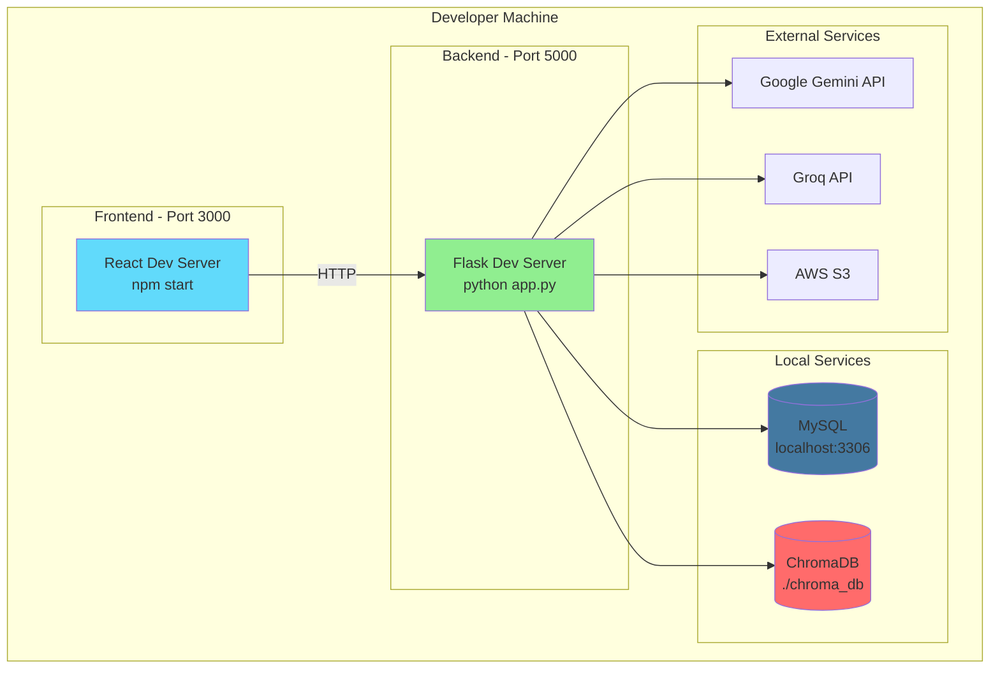

### Production Environment (Proposed)
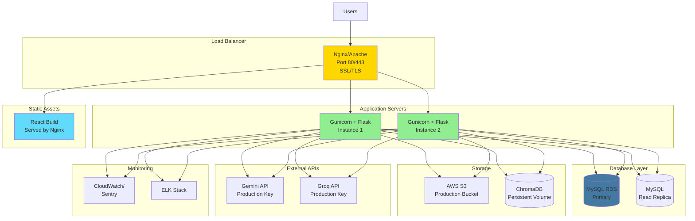

---

## 9. Security Architecture

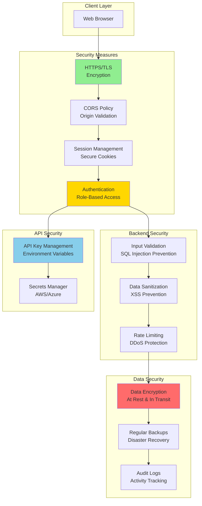

---

## 10. Analytics Dashboard Architecture

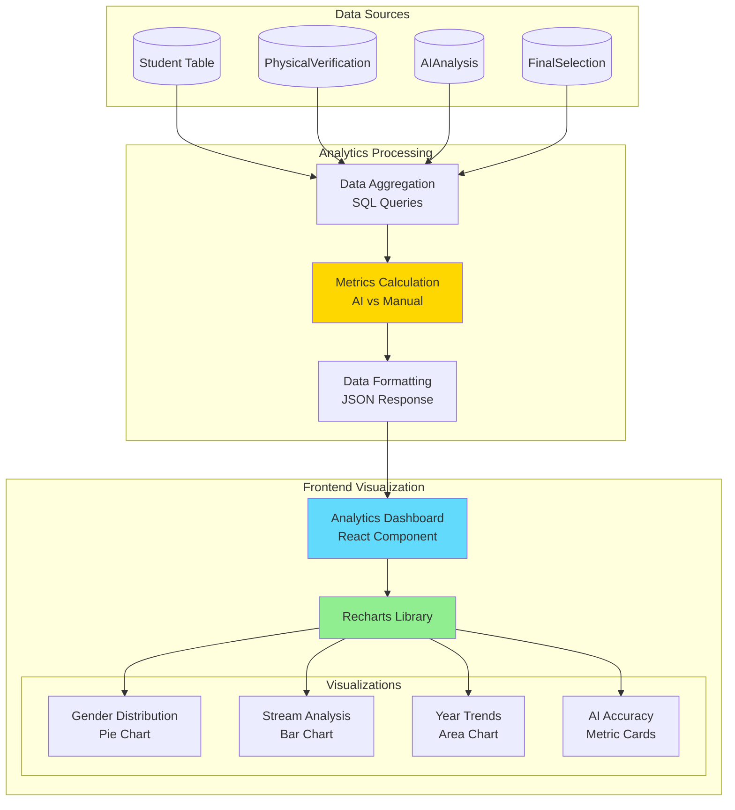

---

## Legend

| Color | Meaning |
|-------|---------|
| 🟦 Blue | Frontend/UI Components |
| 🟩 Green | Backend/API Services |
| 🟨 Yellow | AI/ML Services |
| 🟥 Red | Databases/Storage |
| 🟪 Purple | External Services |
| 🟧 Orange | Security/Auth |

---

**Document Version**: 1.0  
**Created**: January 5, 2026  
**Based on**: Actual Implementation Analysis  
**Format**: Mermaid Diagrams (GitHub/Markdown Compatible)
